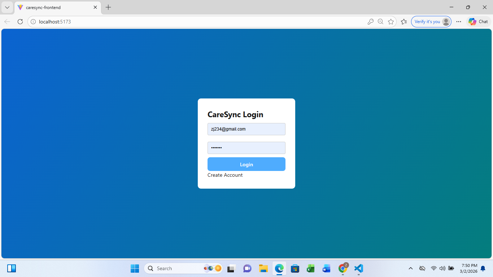
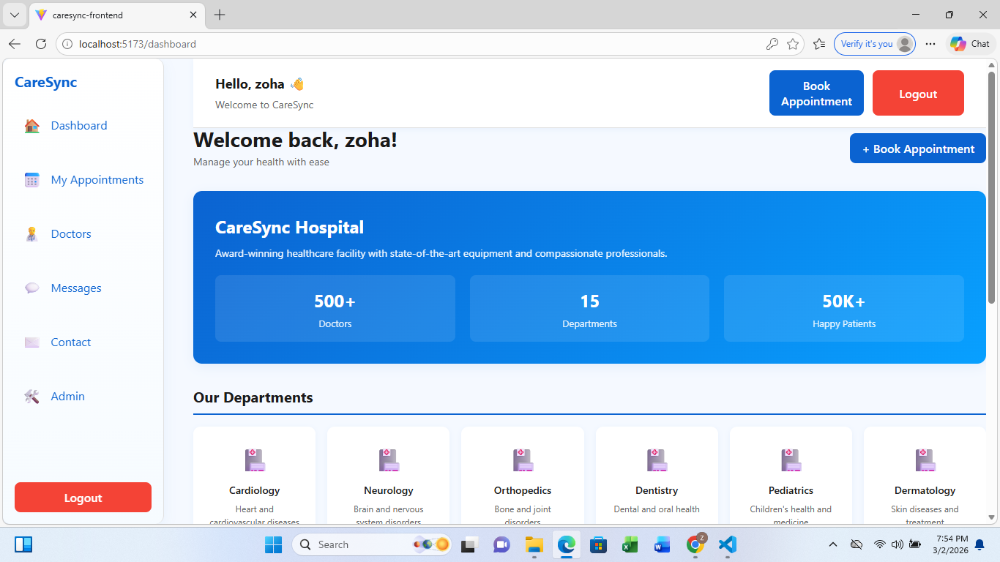
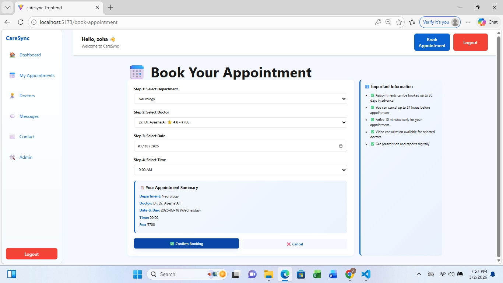
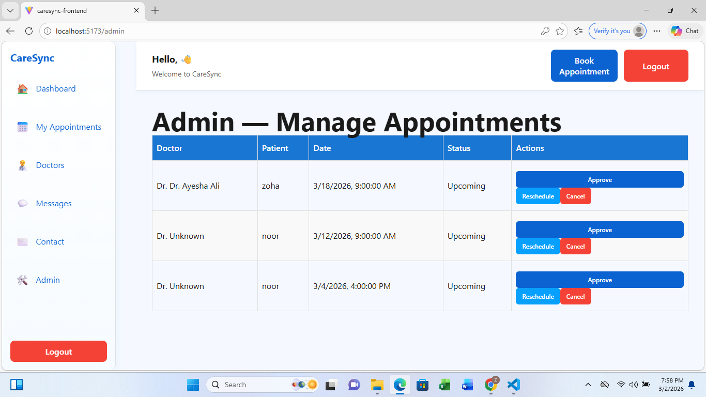

Hospital Appointment System
Full-Stack Hospital Appointment System with patient authentication, doctor management, and appointment booking, built using React, Node.js, Express, and MongoDB.
⚙️ Features
User authentication (Patient login & signup)
Doctor listing with details
Appointment booking system
Appointment cancellation
Dashboard for managing appointments
💻 Technologies Used
Frontend: React, Tailwind CSS / CSS
Backend: Node.js, Express.js
Database: MongoDB
Others: Axios for API calls
## Screenshots

### Login Page

### Dashboard

### Appointment Form

### Admin Page

🚀 How to Run Locally
Clone the repository:
git clone <repo_url>
Navigate to project folder
Install dependencies for backend:
npm install inside backend folder
Install dependencies for frontend:
npm install inside frontend folder
Create .env file for MongoDB connection
Start backend: npm start or node server.js
Start frontend: npm run dev (if using Vite)